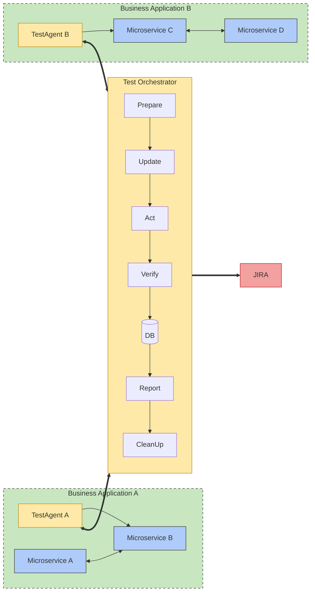
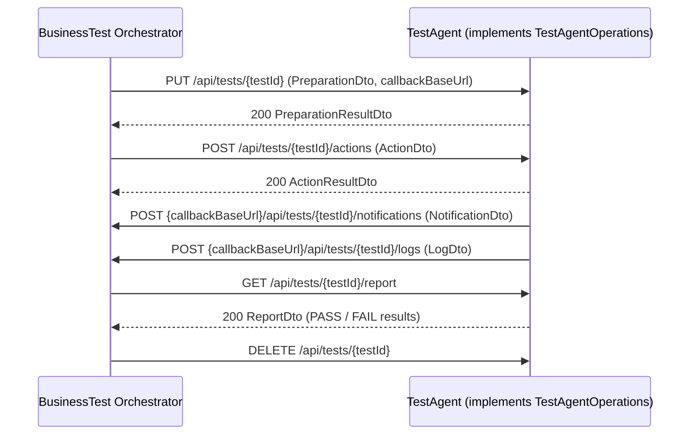

# Architecture

A jEAP **business process test** (BP test) verifies a whole business process across several services.
A central **BusinessTest Orchestrator** runs a test case by coordinating one or more **TestAgents**
(simulators). Each TestAgent represents, or interacts with, one system that participates in the
process. `jeap-bptestagent-api` defines the contract between the orchestrator and the TestAgents; the
orchestrator service itself is out of scope for this library.

## System overview

## Two directions of communication

The interaction is bidirectional and both directions are plain JSON over HTTP:

- **Orchestrator → TestAgent (synchronous control):** the orchestrator drives each agent through the
  test lifecycle by calling the [`TestAgentOperations`](testagent-api.md) REST interface
  (`prepare`, `update`, `act`, `verify`, `cleanUp`), all under `/api/tests/{testId}`. This interface
  *is* the library.
- **TestAgent → Orchestrator (asynchronous feedback):** while the business process runs, an agent
  reports progress, events and log lines back to the orchestrator via
  [callbacks](orchestrator-callbacks.md) (`NotificationDto`, `LogDto`). The agent learns the
  orchestrator's base URL from the `callbackBaseUrl` field in the `prepare` request.

Notifications let the orchestrator react (e.g. trigger the next `act`) and track progress without
having to poll the agents for state.

## Interaction at the API level

## What this library is (and is not)

- It **is** a thin contract library: one Spring MVC interface plus DTOs, with OpenAPI annotations.
- It contains **no** business logic, **no** Spring auto-configuration and **no** configuration
  properties. A TestAgent service supplies the web server, any persistence (to remember `testId`,
  `callbackBaseUrl` and test state) and the callback HTTP client.
- The orchestrator's own REST API (e.g. starting a test run) is **not** part of this library; only the
  callback endpoints an agent must call are documented here, because the agent depends on them.

## Related

- [Getting started](getting-started.md)
- [TestAgent API contract](testagent-api.md)
- [Orchestrator callbacks](orchestrator-callbacks.md)
- [Data transfer objects](data-transfer-objects.md)
